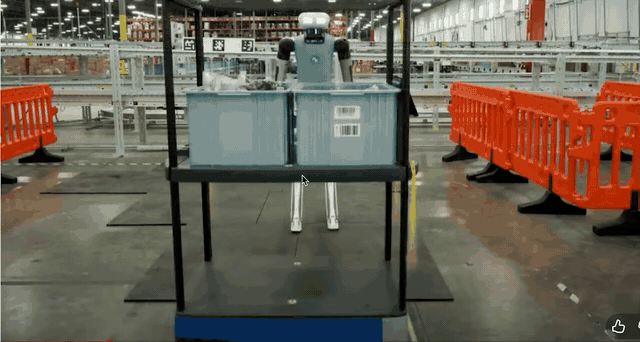
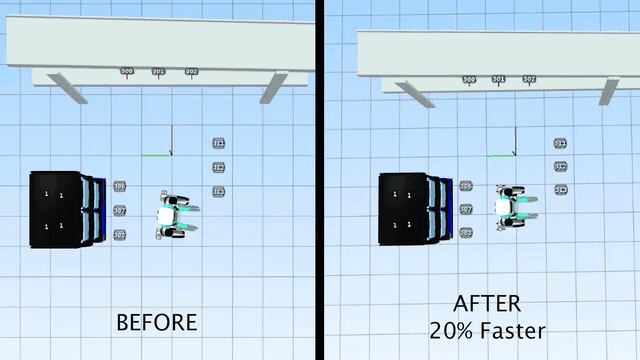
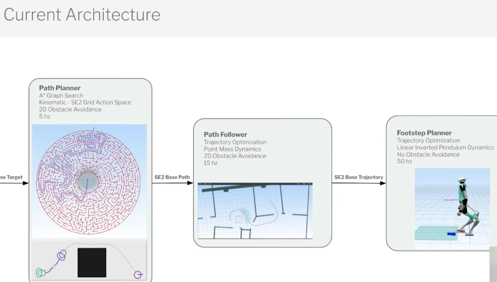

# PATHLAB — Geometric Motion Planning

PATHLAB is both a learning-oriented computational-geometry and motion-planning
platform and a long-term humanoid robotics research platform. Written in C++17
with SFML 3, it builds classical 2D planning tools from first principles, pairs
them with focused tests and theory notes, and exposes their behavior through an
interactive visualizer.

For detailed implementation status, conventions, and milestones, see
[PROJECT_STATE.md](PROJECT_STATE.md).

## PATHLAB in action


The animation shows the deterministic comparison scene, visibility graph,
planner selection, path and expansion metrics, and search playback available
in `demo_2e`.

## Project Motivation

Moving a humanoid through a working environment is not one planning problem.
A global planner must reason about where the robot should go, a footstep
planner must turn that route into discrete contacts, and a controller must
determine whether the resulting motion can actually be executed. The earlier
layers need broad search, while the later dynamics and whole-body evaluations
are much more expensive.

The following external examples motivate that progression. They provide
real-world and research context; they are **not** outputs of PATHLAB and do not
represent systems implemented in this repository.

| Real-world deployment | Planner simulation |
| --- | --- |
| [](https://www.agilityrobotics.com/content/digits-next-steps) | [](https://www.agilityrobotics.com/content/digits-next-steps) |
| **Digit in a warehouse.** Agility Robotics describes navigation in constrained spaces, with payloads, frequent stops, and turns. [View the source article and footage.](https://www.agilityrobotics.com/content/digits-next-steps) | **Footstep-planner comparison.** The supplied Agility simulation presents a before/after planner comparison. Its labels and performance claim are Agility's, not measurements produced by PATHLAB. [View the source article.](https://www.agilityrobotics.com/content/digits-next-steps) |

**Planning-stack context**

<p align="center">
  <a href="https://www.youtube.com/watch?v=VeutCk1xYzI">
    
  </a>
</p>

The illustrated humanoid planning architecture connects a global 2D route to
step-level motion through trajectory following and footstep planning. It is an
external reference rather than a system implemented in PATHLAB. [View the
source video.](https://www.youtube.com/watch?v=VeutCk1xYzI)

As PATHLAB develops from a classical path-planning platform toward humanoid
footstep planning, the research asks whether a global planner can retain broad
search efficiency while using computational geometry to avoid expensive
dynamics evaluations whenever the geometric test is decisive.
## Current implementation status

### Phase 1 — Computational Geometry Foundations

**Complete.** The implemented foundation includes:

- Geometry primitives for points, segments, polygons, paths, and triangles
- Orientation, point-on-segment, segment-intersection, point-in-polygon, and
  collision predicates
- Polygonal obstacle environments with boundary-aware collision semantics

### Phase 2 — Classical 2D Motion Planning

**In progress.** Completed work includes:

- Undirected visibility graphs with Euclidean edge weights
- BFS hop-minimizing search and Dijkstra/A* shortest-path search with path
  reconstruction
- Planner instrumentation, including expanded-node order and count
- Comparisons among BFS, Dijkstra, and A*
- Focused geometry, graph, BFS, Dijkstra, and A* regression tests
- A sequence of permanent SFML demos documenting project milestones
- PATHLAB, an interactive planning and search-visualization application

The next major technical milestone is Voronoi/generalized Voronoi diagram
maximum-clearance planning and an experimental comparison between shortest
paths and high-clearance paths. Nothing beyond the completed work listed above
should be read as implemented.

## PATHLAB

PATHLAB is the current primary application (`demo_2e`). It provides an
interactive canvas for constructing polygonal scenes, placing start and goal
positions, selecting BFS, Dijkstra, or A*, and running the planner.

The interface can display obstacles, the visibility graph, the final path, and
expanded nodes independently. Its metrics panel reports planner status,
obstacle and graph counts, path length and size, **Nodes Expanded**, graph-build
time, search time, and total time.

When a search trace is available, a floating playback dock can reset, play,
pause, or single-step through node expansions. Playback distinguishes the
current node, previously expanded nodes, and completion at the goal. Five
playback speeds are available.

The canvas supports cursor-centered zoom and panning without mixing camera
logic into the geometry or planner layers. Static canvas, obstacle, graph, and
path data are cached in batched SFML vertex arrays. Outside active playback,
the application waits for input instead of continuously redrawing an unchanged
scene. The planner sidebar can be collapsed to reclaim the full canvas width;
camera state, planner results, and playback remain intact while it is toggled.
Selected floating controls, the playback dock, and the sidebar use a restrained
frosted-glass treatment backed by a shared, downsampled Gaussian blur. The
effect falls back to translucent surfaces when shaders are unavailable.

## PATHLAB controls

All placement actions occur on the canvas. Sidebar rows, buttons, selectors,
and playback controls are operated with the left mouse button.

| Action | Control |
| --- | --- |
| Add an obstacle vertex | Left-click the canvas while in the default obstacle mode |
| Finish an obstacle | `Enter` after placing at least three vertices |
| Place or replace the start | Press `S`, then left-click the canvas |
| Place or replace the goal | Press `G`, then left-click the canvas |
| Cancel placement or discard an unfinished obstacle | `Esc` |
| Open or close Help | Click the top-bar **?** button or press `?` |
| Show or hide the planner sidebar | Click the top-bar sidebar icon or press `Tab` |
| Load the showcase scene | Click **Load Demo** at the upper-right of the canvas |
| Select a planner | Choose **BFS**, **Dijkstra**, or **A\*** from the Algorithm selector |
| Run the selected planner | Click **Run Planner** or press `Space` |
| Reset the complete scene | `R` |
| Toggle the visibility graph | `V` or click **Visibility Graph** |
| Toggle obstacles | Click **Obstacles** |
| Toggle the final path | Click **Final Path** |
| Toggle expanded nodes | Click **Explored Nodes** after a search trace exists |
| Pan the canvas | Hold `Option` (`Alt`) and left-drag |
| Zoom around the pointer | Use the mouse wheel or trackpad scroll gesture over the canvas |
| Reset the camera | Click **Reset View** at the upper-right of the current usable canvas |
| Reset search playback | Click the reset control in the playback dock |
| Play or pause playback | Click the play/pause control in the playback dock |
| Advance one expansion | Click the step control in the playback dock |
| Change playback speed | Click the speed control to cycle `0.25×`, `0.5×`, `1×`, `2×`, and `4×` |

`Esc` first closes the open Algorithm menu when applicable. PATHLAB does not
currently provide a separate clear command; `R` removes all obstacles, the
start and goal, and the current planning result.

**Load Demo** replaces the current scene with a deterministic four-obstacle
showcase and resets the camera to its default framing. It preserves the selected
planner and visualization preferences, clears any previous result/playback, and
does not run the planner automatically.

## Build and run

### Requirements

- A C++17 compiler
- CMake 3.16 or newer
- SFML 3 with the Graphics, Window, and System components

On macOS with Homebrew, the dependencies can be installed with:

```bash
brew install cmake sfml
```

Use the repository's runner to configure a Release build in `build-release/`,
build one target, and launch it:

```bash
./run.sh demo_2e
```

The script requires a target name; running `./run.sh` without one only prints
usage information. Available demo targets are:

| Target | Milestone |
| --- | --- |
| `demo_1a` | Segment intersection |
| `demo_1b` | Point in polygon |
| `demo_1c` | Path collision |
| `demo_2a` | Visibility graph |
| `demo_2b` | Dijkstra on a visibility graph |
| `demo_2c` | Interactive Dijkstra planner |
| `demo_2d` | Interactive Dijkstra/A* comparison |
| `demo_2e` | PATHLAB |

## Tests

Run the complete regression suite from the repository root:

```bash
./test.sh
```

This builds and runs the geometry, graph, BFS, Dijkstra, A*, and PATHLAB UI
test executables. The mathematical and planning layers remain independent of
SFML. Tests are registered with CTest, so they can also be run from a configured
build directory with `ctest --output-on-failure`.

## Project structure

| Path | Responsibility |
| --- | --- |
| `assets/` | Runtime fonts, the Gaussian backdrop-blur shader, and README media |
| `src/geometry/` | Geometry types, predicates, collision logic, and polygon triangulation |
| `src/graph/` | Graph representation and visibility-graph construction |
| `src/planners/` | BFS, Dijkstra, and A* search implementations |
| `src/visualization/` | Reusable SFML drawing helpers and legacy demo panels |
| `src/ui/` | PATHLAB interface layout, drawing, and hit testing |
| `src/app/` | PATHLAB application state, input, planning orchestration, playback, camera, and rendering |
| `demos/` | Executable milestones from foundational geometry through PATHLAB |
| `tests/` | Lightweight assert-based regression tests |
| `theory/` | LaTeX notes that develop the geometry and planning concepts alongside the code |

The dependency direction is intentionally simple: geometry, graph, and planner
code do not depend on SFML; visualization and application code consume their
results.

### Immediate next milestone

> Implement and visualize Voronoi/GVD maximum-clearance planning, then compare
> it against visibility-graph shortest-path planning.

A generalized Voronoi diagram (GVD) represents locations equidistant from
nearby obstacles and provides a useful structure for routes that favor
clearance rather than minimum length. The eventual comparison should measure:

- Path length
- Minimum obstacle clearance
- Planning time
- Expanded nodes
- Graph size

This milestone is planned and is not implemented by this README update.

## Development philosophy

The project follows the sequence:

> Theory → Implementation → Tests → Visualization → Experiment

Core algorithms are implemented directly where practical so their geometric
and planning assumptions remain visible. Readability and correctness take
priority over premature optimization, while each demo preserves a working
milestone in the project's progression.
